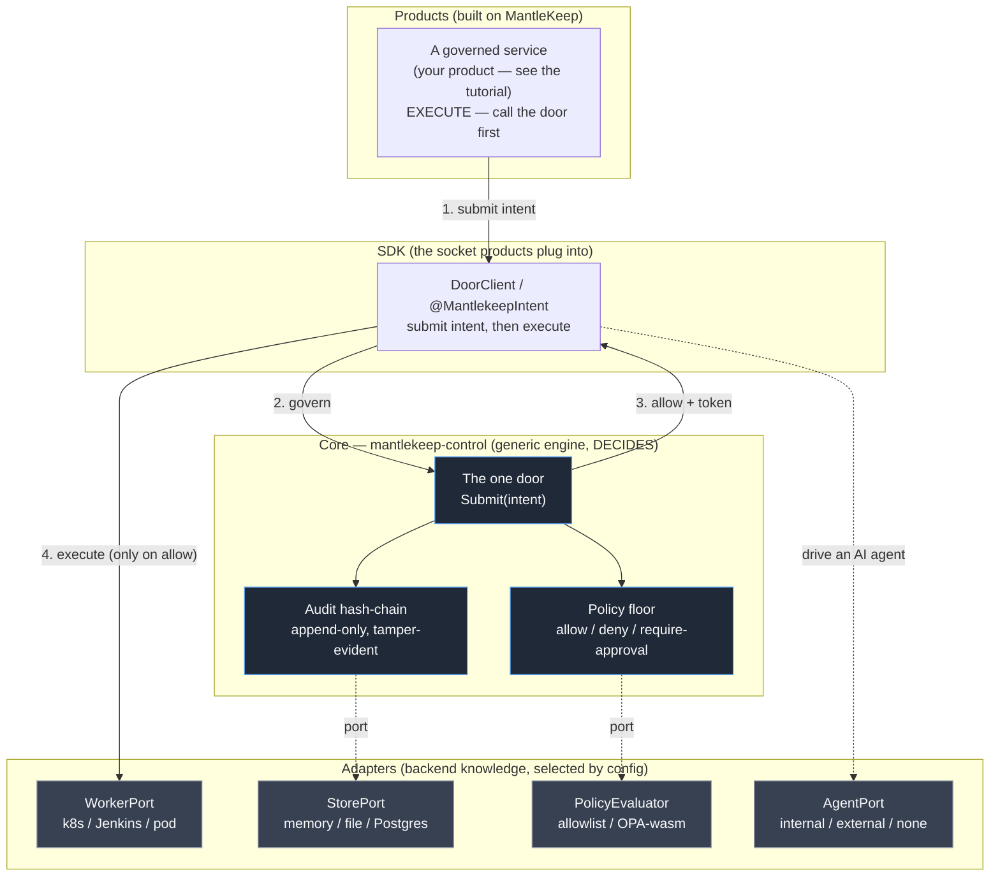

# Architecture

MantleKeep is a **governance framework**: it owns the *shape* of how human and AI
actions are decided and recorded, and rides mature runtimes (Spring/Reactor on the
JVM, Go on the control plane) rather than rebuilding them. This page is the whole
picture on one screen — the diagram, then a full text description of the same thing.

---

## The one routing question

Every piece of a MantleKeep system answers a single question:

> **Does this piece DECIDE, or does it EXECUTE?**
>
> - It **decides** → it belongs in the **control plane** and embeds the core (the door,
>   the hash-chain, policy).
> - It **executes** → it belongs in a **service** and *calls the door* before doing the
>   work.

Deciding and executing never mix in the same place. That separation is what makes
"govern before you execute" structural rather than a convention someone has to
remember.

---

## The diagram



---

## The same picture, in words (text description of the diagram)

Read top to bottom, the system is four layers. Control flows **down** to govern, then
back **up** only if allowed.

**1. Products (top).** Governed services — the kind you build against the SDK in the
[tutorial](build-your-first-product.md). These **execute** — they run real work — so
the rule binds them: each one submits its order to the door *before* acting.

**2. The SDK (the socket).** A service does not talk to the core directly; it uses the
`DoorClient` (or the `@MantlekeepIntent` annotation, which submits for you). This is
the thin, config-driven seam a product plugs into. Dependency direction is one-way and
strict: `product → starter → door-client → adapter-spi`.

**3. The core (`mantlekeep-control`), which decides.** A **generic** governance engine
that knows zero product, action, environment, or role names. It contains:

- **The one door** — `Submit(intent)`. Every action, human or AI, passes through this
  single choke point. There is no bypass.
- **The policy floor** — evaluates the intent and returns allow, deny, or
  require-approval. It embeds **no** policy by default: with nothing loaded, the door
  **denies** (safe by default). Actions, environments, and roles are supplied as
  *data* by product/team policy layers, cascaded default → platform → team, honouring
  sealed floors a lower layer may only tighten, never loosen.
- **The audit hash-chain** — an append-only ledger where every decision (allow **and**
  deny) is recorded, each record linking to the prior record's hash. Tampering with any
  record breaks the chain, and re-verifying detects it. Evidence is a byproduct of
  governing, captured automatically.

**4. Adapters (bottom), off the ports.** The core knows only a **port** (an interface);
the backend knowledge lives in an **adapter** selected by configuration:

- `WorkerPort` → how approved work is dispatched (a Kubernetes Job, a Jenkins trigger,
  a pod).
- `StorePort` → where the chain lives (memory, file, Postgres).
- `PolicyEvaluator` → the decision engine (a fixed allowlist, OPA compiled to wasm, a
  rules engine).
- `AgentPort` → which AI harness runs an agent task (internal model, external API
  behind the mandatory proxy, or none — bring-your-own-key).

**The path of one governed action** (the numbered edges): a service submits an intent
to the SDK **(1)**; the SDK governs it through the door **(2)**; the door consults the
policy port and records the verdict on the chain; on allow, the door returns an
execution token **(3)**; only then does the service execute, through the `WorkerPort`
**(4)**. A deny stops at step 2 — the execute edge is never taken, and no side effect
runs.

---

## Dependency direction (the rule that keeps the core generic)

```
product  ──▶  sdk  ──▶  core
```

Dependencies point **inward only**. Products and adapters depend on the core's ports;
the core never depends on a product or an adapter. Backend concerns (a database driver,
a Kubernetes client, an LLM SDK) live in the adapter jars, never on the core's
classpath — which also means a CVE in a backend dependency is isolated to the adapter
that pulls it, not the governance engine.

Because the core knows only ports, you extend the system by **adding an adapter and
selecting it by config** — never by editing the core. That is covered in
[extending.md](extending.md); [build-your-first-product.md](build-your-first-product.md)
walks the whole loop as runnable code; [why-govern-ai.md](why-govern-ai.md) is the case
for governing this way at all.
